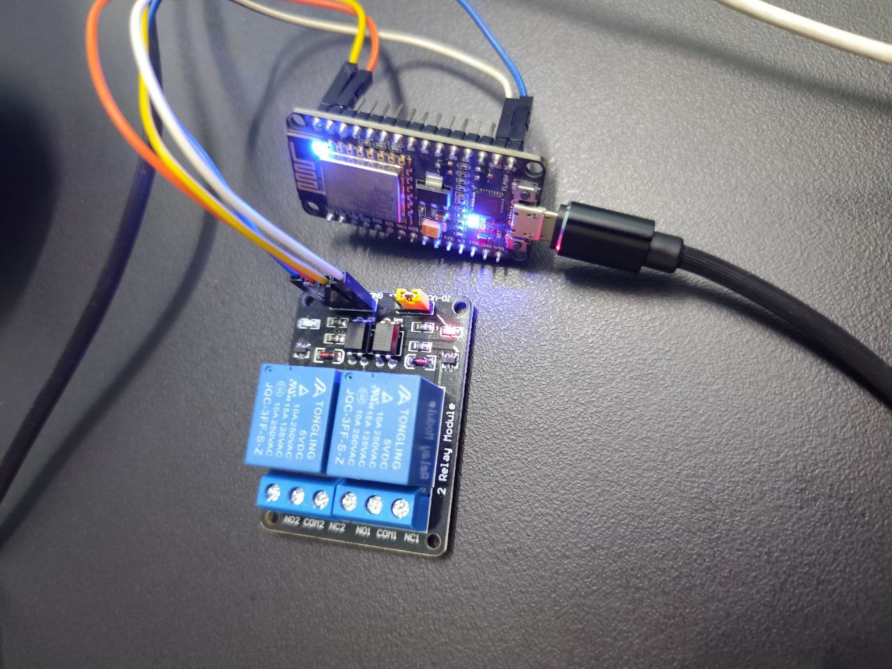

# Smart Electronic RoadBlock

# Wiring

You can upload this source code on `ESP-E12` Board.

With this code you can connect to a Wifi network then Run a websocket server after that When you send `open` or `close` command over `websocket` connection, You can Control Rellay.
* Rellay should connect to `D0` pin of board.

# Contrubiting
Contributions are welcome. Please fork the repository and submit merge requests with your changes.